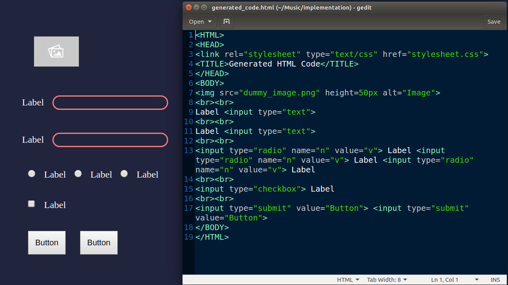

# Automatic HTML Code Generation from Images
[](https://shields.io/)

This project takes a 'hand-drawn HTML page layout' image as an input from the user and converts it into a functional HTML webpage!

If you have a webpage design in mind but don't want to code the basic stuff? Well, now you don't have to. Just clone/download this repository, complete the setup and generate well-formatted HTML code for your website design in seconds.

**Input Image:**


**Output Page and Code:**



## Contents

1. [Installation Guide](##Installation-Guide)
2. [Usage Instruction](#Usage-Instruction)
3. [Demo](#Demo)
4. [Contributing to this project](#Contributing)
5. [License](#License)

## Installation Guide

1. Clone/Download the Official TensorFlow models GitHub repository:

   [Go to Official Tensorflow models GitHub page](https://github.com/tensorflow/models)
  
2. Visit the /models/research/object_detection page and follow the setup instructions to install all the dependencies required to run the Object Detection files.

   [Go to models/research/object_detection GitHub page](https://github.com/tensorflow/models/tree/master/research/object_detection)

   [View installation guide for Object Detection API](https://github.com/tensorflow/models/blob/master/research/object_detection/g3doc/installation.md)

3. The library dependencies can be installed from the requirements.txt file using the following command:

   ```bash
   pip install -r requirements.txt
   ```
   **INSTALL TENSORFLOW 1.15.0**
   
   (not listed in requirements.txt because there is no pip package for tf 1.15)
   
   Download a .whl file from the following link (considering your python version and operating system):
   https://pypi.org/project/tensorflow/1.15.0/#files
   
   Install the .whl file using the the following command (update your pip before proceeding):
   ```bash
   pip install PATH_TO_FILE/name_of_file.whl
   ```
   
4. Replace the visualization_utils.py 

   Go to the directory where you have downloaded the Official Tensorflow models repository. Find the 'utils' folder inside object_detection directory by navigating:

   ```bash
   DIR_WHERE_REPO_IS_CLONED/models/research/object_detection/utils/
   ```
  
   Find the **visualization_utils.py** file inside utils directory and replace it with the **visualization_utils.py** file provided in this repository.

5. Download the **frozen_inference_graph_816.pb** file from the link provided in the _how_to_download_trained_model.txt_  file. Alternatively, it can be downloaded using this [link](https://www.dropbox.com/sh/r7m3p0qikumtjuc/AABKP8kGBUzE8-pJo-WqGWD9a?dl=0). 

6. Go through each .py file and specify paths to the required files. Read the comments around the path variables to understand the requirements. 

## Usage Instruction

After the setup is done, running this project is quite straight forward. 

Use these symbols to represent the HTML Elements in your website design.
 


Draw the design using the symbols on a plain white (preferably A4 size) sheet and click a picture in decent lighting. Specify the path of the image in the `main.py` file run it using one line of code from your terminal.
 
```python
python main.py
```
Depending on the processing hardware, it might take some time to execute. The preprocessed image with detected elements is displayed to show which elements have been identified. This image can be closed by pressing any key after which, the webpage would automatically open in a new browser window. Generated HTML code can be found in _generated_code.html_  file in the specified directory.

## Demo

Click on the image to watch the demo video on YouTube.

[](https://youtu.be/UQYS5Qtyd98)

## Contributing
Pull requests are welcome. For major changes, please open an issue first to discuss what you would like to change. Please perform the appropriate testing of proposed additions before creating a pull request.

## License
[MIT](https://choosealicense.com/licenses/mit/)
